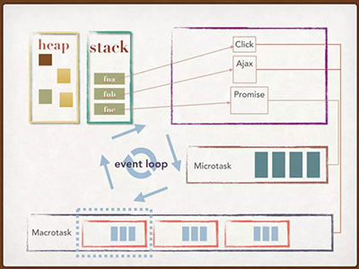

# 概念
>看过多人的事件循环文章，颇有收获，因此总结下供自己随时参阅。

## 为什么会有事件循环Event Loop?
因为JS是单线程的（执行JS代码的只有1个线程，通常会说主线程）。一个线程，执行过多任务或者任务过复杂，就会出现阻塞，因此有些如ajax耗时函数则交由其他线程处理，一旦有结果则会将为其事件条件满足设置的回调函数加入到任务队列中，EventLoop是一个机制，当当前执行栈清空后，则从任务队列中查询任务，拉出来执行，重复执行该过程。


## 图形话EventLoop
图片摘自掘金作者【奉献】的事件循环文章



图中有2个新的概念**Macrotask**和**Microtask**

## Macrotask
通常所说的任务队列，也就是Task。在ES6提出Promise之前，应该只有Task这个队列，后来规范规定清楚了2种队列，Task就成了Macrotask，也叫宏任务队列。满足条件的事件，则进入该队列，如定时器函数（setTimeout, setInterval, setImmediate等），ajax回调函数，UI交互事件（click等）

## Microtask
微任务队列，也叫Job，粒度比Task小。存放Promise.nextTick，Promise.then()之流的任务。

## 两个队列的优先级和插入执行时机
微任务处理优先于宏任务处理。只有处理完清空了微任务队列，EventLoop才会从Macrotask取一个宏任务进行处理。微任务会插入到下个Tick之前执行

## 事件循环的一轮怎么界定？
这个问题困扰我比较久，查了很多资料，从【这波能反杀】作者写的事件循环机制中找到了明显的答案，结合参考了其他多篇事件循环不错的博文，如掘金的【王下邀月熊】和【奉献】2位作者的文章。

**事件循环**的开始：JS全局代码（算宏任务）入栈。

**事件循环**的结束：全局代码执行完，检查Micro是否有微任务，如果有，将微任务队列中函数放入执行栈依次执行完。清空微任务队列。至此第一轮事件循环结束。第二轮，即从下一个Macro任务开始，如此循环。
图片摘自掘金【王下邀月熊】的事件循环文章


## 代码上理解
> 纯文字解释不容易理解，结合代码
```js
  var beginEventFlag = '开始事件循环'; 
  console.log(beginEventFlag);

  setTimeout(() => { // 异步
    console.log('500s执行')
  },500)

  var p = new Promise(function(resolve, reject){
    resolve(5);
  })
  p.then(function(r){
    console.log(r);
    var p2 = new Promise(function(resolve, reject){
      resolve('又是5')
    })
    p2.then(function(d) {
      console.log(d)
    })     
    setTimeout(() => {
      console.log('又是500s执行')     
    },1000)
  })
```
Chrome中打印结果为：'开始时间循环'，5，又是5，500s执行，又是500s执行。

结合概念中来分析此段代码：
1. 全局代码（同步函数，宏任务）入栈，打印‘开始事件循环’。
2. 遇到setTimeout（第一个），计时交由浏览器对应的定时器线程，并将其回调塞入宏任务队列中。
2. 执行new Promise代码，立刻决议这个p。并将其p.then放入微任务队列中。
3. 没有其他同步代码了，检查微任务队列，执行，打印‘5’。遇到p2，立刻决议，将p2.then塞入微任务队列。遇到setTimeout（第二个），塞入宏任务队列。
4. 继续检查微任务队列，发现刚塞入微任务队列的p2.then，执行，打印‘又是5’。至此微任务队列清空完毕。
5. 下一轮事件循环开始，宏任务队列中第一个setTimeout的回调执行，打印‘500s执行’。
6. 检查微任务队列，没有Job需要执行。
7. 再下一轮事件循环开始，宏任务队列中的第二个setTiemout的回调执行，打印‘又是500s执行’。

## 总结
本文参考了很多博文，简化不少东西，笔者主要是为了记录并方便自己的理解，如果有问题，欢迎指正。
