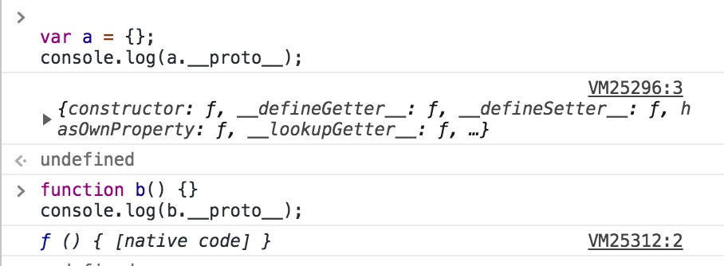
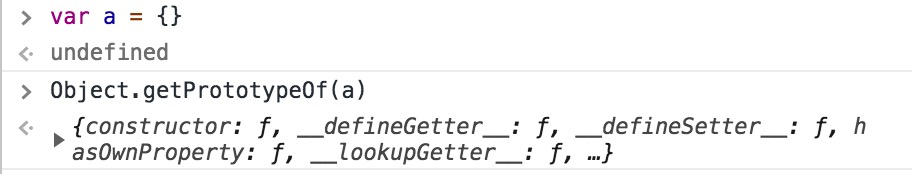

# 原型和继承初识

初步介绍下原型和继承，以及相关的 API.

## 原型是什么

所有的对象（包括函数）都有一个隐藏的内部属性`[[Prototype]]`，该属性引用的就是**原型**，原型本身也是一个对象，所以原型自己也有原型。

## 原型长什么样

因为`[[Prototype]]`是内部属性，所以通过代码无法访问，但是我们有其他方式访问到原型。

### 构造函数才有的 prototype

这是 JS 早期就有的属性，**只有函数才有，字面量对象是没有的**，可以在控制台尝试访问一个字面量对象的`prototype`，发现是`undefined`。所以这个功能有限。

```js
function Person(name) {
  this.name = name;
}

console.log(Person.prototype);
```

结果如图：


### \_\_proto\_\_

2012 年，`Object.create()`被写入标准，提供了使用给定原型创建对象的能力，然后还是没有提供`set/get`原型的能力，浏览器厂商们因此实现了非标准的`__proto__`访问器属性，允许用户随时修改和获取原型对象。

```js
var a = {};
console.log(a.__proto__);

function b() {}
console.log(b.__proto__);
```

结果如图：


### 标准方法 Object.getPrototypeOf 和 Object.setPrototypeOf

2015 年，这 2 个方法被加入到标准中。但是因为`__proto__`在很多浏览器都得到了实现，即便过时，但也被加入到标准的附件中了。

```js
var a = {};
Object.getPrototypeOf(a);
```

结果如图


总结：从上面的几个代码案例看出来，我们所打印的**原型就是对象**。

## 原型的作用

当我们想要访问一个对象的属性时，先从对象自身查找，如果没有，会去对象的私有属性`[[Prototype]]` 所引用的原型对象上去找。

```js
var parent = {
  run: true,
};

var son = {};

Object.setPrototypeOf(son, parent); // 等于 son.__proto__ = parent

son.run; // true son对象本身没有run属性，所以会沿着[[Prototype]]指向的原型对象上去找
```

这个特性可以让我们复用逻辑，实现面向对象语言中的 **继承** 特性。

## JS 中的继承

JS 中的继承是通过`[[Prototype]]`来实现的，即便在 ES6 时代有了`class`关键字。

早期的函数方式继承：

```js
function Person() {
  this.run = true;
}

function Son() {}

Son.prototype = new Person();

var son = new Son();
son.run; // true
```

使用 es6 关键字`class`实现

```js
class Parent {
  constructor() {
    this.run = true;
  }
}

class Son extends Parent {
  constructor() {
    super();
  }
}

const son = new Son();
son.run;
```

# 总结

原型是一个对象的内部属性`[[Prototype]]`所引用的一个对象。从 JS 诞生开始，就有`F.prototype`的方式可以访问到原型，和修改原型，但是只有函数才有`prototype`，后来浏览器厂商自己实现了`__proto__`访问器属性来实现对原型的`set/get`，直到 ES 标准规定了原型的访问和设置的方法`Object.getPrototypeOf`和`Object.setPrototypeOf`。

原型存在的最大作用是**继承**，JS 中的继承都是**原型继承**，从以前的`函数继承`到现在的`class`类语法糖来实现继承。
