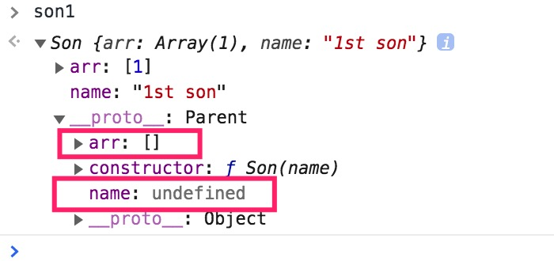
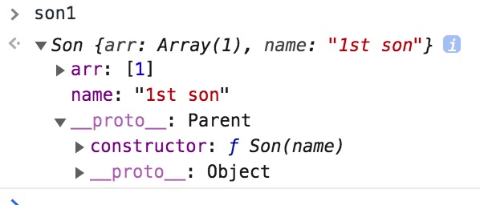

# 探究继承

JS 世界的继承如何实现，原型在继承中的作用，以前的继承和现在的继承。

## 原型查找机制

JS 中继承依赖原型实现，访问一个实例不存在的属性时，会去实例的原型对象上查找。

```js
function Parent() {}
Parent.prototype.run = true;
var person = new Parent();
person.run; // true
```

如果实例原型上不存在，则会去实例原型的原型上查找，以此类推直到**原型顶端，也就是 null**。

```js
var a = {};
a.__proto__; // Object.prototype
a.__proto__.__proto__; // 也就是 Object.prototype.__proto__  = null
```

JS 中一切皆对象，函数也是对象，我们看看函数的**原型链**（原型-原型-原型-...这种链式，被称为原型链）

```js
function b() {}
b.__proto__ === Function.prototype; // true f () { [native code] } 也就是 Function.prototype
b.__proto__.__proto__ === Object.prototype; // true 也就是Function.prototype.__proto__，别忘了Function.prototype也是对象，所以其原型是 Object.prototype。这也说明了，JS中一切皆对象！
b.__proto__.__proto__.__proto__ === null; // true Object.prototype.__proto__ === null 到头了
```

配合 JS 原型链查找机制，因此出现了 JS 版本的继承。

## new 实例化

JS 中通过`构造函数`来模拟类，通过`prototype`来模拟继承。类的实例化则需要用`new`关键字，`new F()`。我们看看`new`做了些什么：

```js
function Person() {}
var a = new Person();
```

目前我们就看到`new`做了三件事：

1. 创建了一个新的对象
2. 返回了该对象\*\*赋值给了`a变量`。
3. 并且 a 实例的`[[Prototype]]`关联到了`Person.prototype`，我们可以通过 a.xx 访问到`Person.prototype`的方法和属性，还记得吧！

因为构造函数模拟了类，类是可以有属性和方法的，我们来给上面的`Person`类加点料

```js
function Person(name) {
  this.name = name; // 类属性
  this.sayHi = function () {
    // 类方法
    console.log(`Hi ${this.name}`);
  };
}

var a = new Person('Jack');
a.name; // Jack
a.sayHi(); // Hi Jack

var b = new Person('Loose');
b.name; // Loose
b.sayHi(); // Hi Loose
```

可以看到，通过`Person`类，我们声明了 2 个实例 `a 和 b`，分别访问 `name` 和 `sayHi` 方法，使用了实例自己的 `name` 值，所以`Person`类在实例化时，里面的 `this` 指向了实例对象。

所以`new`一共做了四件事。

4. 实例化时将 this 指向新的对象。

模拟实现一个简单的`new`

```js
// function myNew(Constructor, Params) : object
function myNew(fn) {
  var obj = {};
  obj.__proto__ = fn.prototype; // 或者 var obj = Object.create(fn.prototype)
  var result = fn.apply(obj, [].slice.call(arguments, 1)); // 调用构造函数fn，并且注意绑定this到新对象，这里就是obj。给构造函数fn的其他参数要排除fn自身。
  return typeof result === 'object' ? result : obj;
}
```

## 谁继承谁

只有一个类，谈不上继承，至少需要一个父类，一个子类继承父类。JS 继承依赖的是原型，请牢记！

接着，先看一个错误的例子

```js
function Parent() {}
function Son() {}
Son.prototype = Parent.prototype; // 这不是继承，这是赤裸裸的让子类原型 和 父类原型 指向同一个对象。
Son.prototype.constructor = Son; // 纠正上面一行导致constructor被改写的问题，让它指向正确值

var son = new Son();
son.constructor === Son; // true 没问题，毕竟上面重写了constructor
son.__proto__ === Son.prototype; // true
son.__proto__ === Parent.prototype; // true
son.__proto__.__proto__ === Object.prototype; // true

// 而且
var parent = new Parent();
parent.constructor === Parent; // false 因为父子类原型都相等了，且上Son.prototype.constructor = Son，导致父类实例现在出问题了。
```

上面的例子并没有体现`Son`继承了`Parent`，而是直接让父子类的原型相等了，还导致父类实例的`constructor`指向到了`Son`上，完全错误！

原型继承要达到的是子类原型 继承自 父类的原型，也就是`son.__proto__.__proto__ === Parent.prototype`，且父类实例和子类实例的`constructor`都要指向正确的值才对。

我们看看正确的写法

```js
function Parent() {}
function Son() {}
Son.prototype = new Parent(); // 这里实现继承！new Parent()返回了一个对象，这里是一个空的{}，但是其原型指向的时Parent.prototype对象哦，也就是{constructor: Parent}
Son.prototype.constructor = Son;

var son = new Son();
son.constructor === Son; // true
son.__proto__ === Son.prototype; // true
son.__proto__.__proto__ === Parent.prototype; // true

var parent = new Parent();
parent.constructor === Parent; // true
```

这下没问题了，可以看到`son`实例的原型指向`Son类`，而`Son类`又继承自`Parent类`。各自类实例的`constructor`指向也正确。

## 继承版本演进

### 常见形式（原型继承）

最常见的形式是将属性写在构造函数中，方法写在原型对象上。

```js
function Parent() {
  this.arr = [];
}

Parent.prototype.print = function () {
  console.log(this.arr);
};

function Son() {}

Son.prototype = new Parent(); // *
Son.prototype.constructor = Son;

var son = new Son();

son.arr.push(1);

son.print(); // [1]

var son2 = new Son();
son2.print(); // [1]
```

son2 不应该打印出`[1]`。原因是上面\*所在的代码导致，`Son.prototype`等于`{arr: []}`，后面实例化的`son1 son2`访问的都是原型上的`arr`，引用类型，因此`son2.arr`也打印`[1]`。

子类实例共享了原型对象上的属性，这种继承是有问题的。所以解决方案就是共享属性移到每个实例自己身上就可以了。

### 组合继承模式（借用构造函数+原型继承）

借用构造函数，意思是`Parent`在`Son`中调用，类似`class`继承中的`super`调用。注意处理`this`指向，毕竟是借用，`this`需要指向`Son`，不然借用无意义。另外，借用还让我们有机会往父类构造函数传参。

```js
function Parent(name) {
  this.arr = [];
  this.name = name;
}
Parent.prototype.print = function () {
  console.log(this.arr);
};
Parent.prototype.say = function () {
  console.log(`Hi ${this.name}`);
};
function Son(name) {
  Parent.call(this, name); // *
}
Son.prototype = new Parent();
Son.prototype.constructor = Son;

var son1 = new Son('1st son');
son1.arr.push(1); // [1]

var son2 = new Son('2rd son');
son2.print(); // []

son1.arr === son2.arr; // false

son1.say(); // 1st son
son2.say(); // 2rd son
```

上面的\*实现了借用构造功能，调用时，this 指向的是 son 实例本身，因此`Parent`构造函数中的代码会往实例本身添加`arr`和`name`属性。`Son`实例各自拥有自身属性，但方法依旧共享`Parent.prototype`上的。

这种模式的缺点在于：

- `Parent`被调用了 2 次，一次是`Son`内借用，一次是`Son.prototype`设置
- `arr`和`name`属性也被创建了 2 次，因为`Parent`调用了 2 次。在`Son`的实例身上和`Son.prototype`原型身上分别创建了，然后 **遮蔽效应** 让我们在访问 `son1.arr`时，优先从自身找到`arr`属性，而不是原型上的。从下图我们可以看出。



### 寄生组合式继承

上面的组合继承的缺点就是调用了 2 次，那我们就想办法只调用一次`Parent`就可以了。

分析下，`Son`在通过`new`实例化的时候，需要将属性挂载到实例身上，否则多个实例就共用了属性，所以`Son`内的借用构造函数不能省略，这是让`Son`实例有自身属性的唯一办法。那就只能从`Son.prototype = new Parent()`身上想办法，用别的方式来继承。

#### Object.create(proto[, propertiesObject])

这个是 ES 标准中的方法，创建一个新对象，使用传入的`proto`作为原型，并返回这个新对象。第二个参数是自定义新对象的一些属性，和`Object.defineProperties`方法的参数一样。

```js
var parentProto = {
  say: function () {
    console.log('say hi');
  },
};

var obj = Object.create(parentProto);
obj.say(); // say hi
obj.__proto__ === parentProto; // true
```

但这个方法也有一个缺陷，就是引用类型值共享了。

```js
var parentProto = {
  arr: [],
};
var o1 = Object.create(parentProto);
var o2 = Object.create(parentProto);

o1.arr.push(1);
console.log(o2.arr); // [1] 因为访问的都是原型对象上的arr。
```

##### 模拟 Object.create

IE9 以下是不支持这个方法的，所以考虑到浏览器兼容，我们可以模拟这个方法。

模拟的关键就是理解`Object.create`干了什么事。

1. 创建了一个新的对象
2. 将参数设置为新对象的原型
3. 返回这个新对象。

```js
function ObjectCreate(proto) {
  function F() {}
  F.prototype = proto;
  return new F();
}
```

功能如`Object.create`

```js
function ObjectCreate(proto) {
  function F() {}
  F.prototype = proto;
  return new F();
}

var parentProto = {
  say: function () {
    console.log('say hi');
  },
};

var obj = ObjectCreate(parentProto);
obj.say(); // say hi
```

寄生组合式继承需要用到的**关联原型**我们已经说清楚，该功能就是用来解决寄生组合继承开篇说到的`Parent`被多`new`了一次来关联原型。

我们来用寄生组合模式重写组合继承模式中 demo。

```js
function Parent(name) {
  this.arr = [];
  this.name = name;
}
Parent.prototype.print = function () {
  console.log(this.arr);
};
Parent.prototype.say = function () {
  console.log(`Hi ${this.name}`);
};
function Son(name) {
  Parent.call(this, name);
}
// Son.prototype = new Parent();
Son.prototype = Object.create(Parent.prototype); // 原型关联方法改造。兼容IE9以下可以使用上面的模拟Object.create函数ObjectCreate
Son.prototype.constructor = Son;

var son1 = new Son('1st son');
son1.arr.push(1); // [1]

var son2 = new Son('2rd son');
son2.print(); // []

son1.arr === son2.arr; // false

son1.say(); // 1st son
son2.say(); // 2rd son
```

从下图可以看出，属性没有重复声明了。


### ES6+的继承

自从 ES6 推出了`class`和`extends`语法后，JS 中继变得简单了，可以将新的语法看成是函数继承的语法糖，核心功能还是通过`prototpye`来实现继承，之外有些表现是不同于 ES5 的继承。

使用新语法改写上面的父子类 demo

```js
class Parent {
  constructor(name) {
    this.arr = [];
    this.name = name;
  }

  print() {
    console.log(this.arr);
  }

  say() {
    console.log(`Hi ${this.name}`);
  }
}

class Son extends Parent {
  constructor(name) {
    super(name);
  }
}

let son1 = new Son('1st son');
let son2 = new Son('2rd son');
```

有哪些区别？

- `class`必须通过`new`调用
- `class`上所有的属性和方法，均不可枚举。
- `class`存在声明提升（赋值没有）
- `class`继承，子类`constructor`里**必须先调用`super()`调用父类构造函数**。因为子类期望父类的`constructor`来完成 `new F()`干的事，否则没有新对象，无法赋值`this`
- 因为函数就是内置`Function`的实例，所以`Son.__proto__`指向的是`Function.prototype`，而类写法`Son.__proto__`指向的是`Parent`，因为`Son`继承自`Parent`么，利索当然原型应该指向`Parent`，在通过`babel`转换语法后，可以看到实现是：

```js
function Parent() {}
var Son = Object.create(Parent);
```

# 总结

1. 继承的根本就是原型链的继承（委托），不管是 ES5 还是 ES6+时代。
2. ES5 时代前的继承是通过函数来模拟实现的。其中最完美的方式是**寄生组合式继承**，也就是基于`prototype`来书写公共方法，基于`Object.create`（模拟函数）来让子类关联父类的原型对象。
3. 我们在 ES5 继承模式中，顺带也清楚了解的`new`的工作以及模拟`new`的实现，还有`Object.create`的工作及其模拟实现。
4. ES6 时代的`class`语法，继承实现，以及它和函数继承的一些差别。
