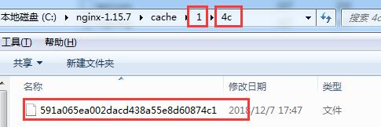
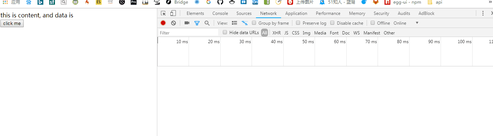
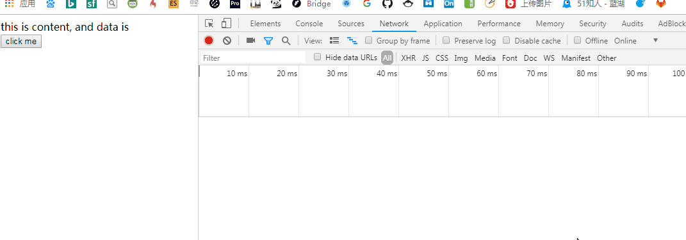
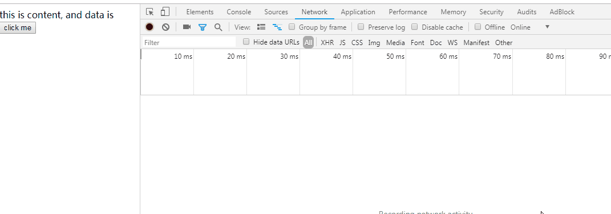
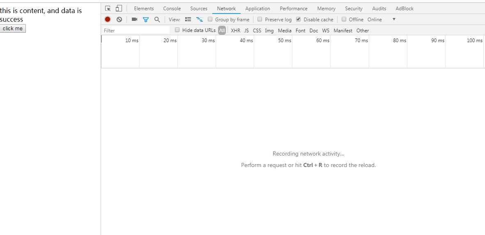
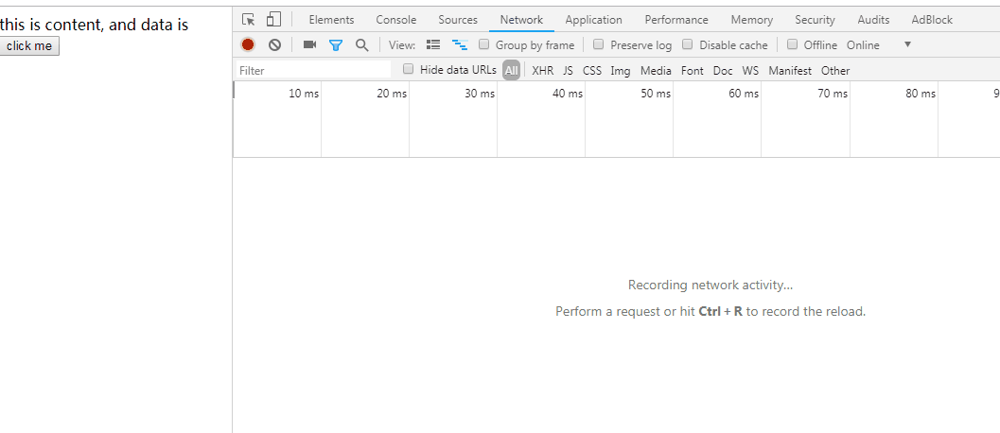

# Nginx

是一个代理服务器，处理 HTTP 服务的。其实就是一个软件。

## 安装

MAC 系统下，通过`brew`命令安装`brew install nginx`，安装目录默认是`/usr/local/etc/nginx`。

## 简单的使用命令

**启动**: `nginx`

**更新配置重启**: `nginx -s reload`

**停止**: `nginx -s stop`

## 代理

本地开启`nginx`服务后，监听`80`端口，访问到 nginx 上，然后 nginx 进行请求跳转到真正的资源上去。这里需要对 nginx 的`nginx.conf`文件进行配置，该文件位置在`/usr/local/etc/nginx/nginx.conf`。

这里我们测试访问`test.com`时，访问到另一个正在运行的`node`服务上。

首先，需要修改本地`host`文件，让浏览器访问本地的 IP。`host`文件位置在`/private/etc/hosts`，增加一句`127.0.0.1 test.com`。

然后我们在 nginx 目录的`servers`下新建一个`test.conf`文件，因为`nginx.conf` 会将`servers`所有配置`include`进来，这样利于维护。

```javascript

server {
  listen 80;
  server_name test.com;

  location / {
    proxy_pass http://127.0.0.1:8888;
    proxy_set_header Host $host;
  }
}

```

然后当我们访问`test.com`时，就会正常访问到`http://127.0.0.1:8888`上去。

## 代理缓存

Nginx 的也是一个 HTTP 服务器，通常用作代理服务器，所以也可以缓存一些静态资源。

### 与浏览器缓存的区别

代理缓存是在 Nginx 上的缓存，所有请求都会先到 nginx，如果 nginx 已经有了对应的缓存资源，且符合缓存使用条件，则可以直接返回给客户端，A 先请求过，资源缓存在代理服务器了，B 再请求，直接拿到缓存资源。

而浏览器缓存仅仅针对每个独立的客户端的，A 和 B 都需要先请求一次资源才能缓存在浏览器内存或磁盘中。

**注意观察请求响应头**，浏览器缓存直接从客户端磁盘或内存中拿缓存数据，而代理缓存，客户单依旧会向代理服务器请求，只不过代理服务器这边返回了它自己的缓存数据，而不请求源服务器，因此也很快响应。

### proxy_cache_path

预先设置缓存的位置及空间名（必填）。也可以在此设置其他选项。格式如下：`proxy_cache_path cache/nginx2 levels=1:2 keys_zone=my_cache:10m`

这里缓存路径是 cache/nginx2（windows 路径，mac 下可设置/var/cache 等自定义目录）。
**levels=1:2**是否设置多级缓存目录，`1:2`意思就是一级目录 1 个字符，二级目录 2 个字符，然后里面存元数据。如图


**keys_zone**缓存空间名称，我们会在匹配到的 location 中使用对应的名称。

**10m**存储空间大小 10mb。

### proxy_cache

开启代理缓存，值是缓存空间名。如下：`proxy_cache: my_cache`

## 测试代理缓存

### 测试的内容

通过点击按钮发起请求，来进行第一次和后几次的数据获取。在服务端对数据获取做一个模拟的延迟。

<!-- 可以发现第一次会慢点，再次发起请求就会直接走代理缓存，很快就响应，换一个浏览器去访问，在缓存有效期内也会很快响应。 -->

**测试 1（不加任何 Cache-Control）**
每次都会从源服务器请求


**测试 2（添加 max-age:5）**
还记得`cache-control`那篇相关的文章里所说，这个值是给浏览器缓存使用。所以缓存时间内会看到`from disk cache`。一旦超过缓存时间，又会向源服务器请求。


**测试 3（添加 s-maxage: 8）**

`s-maxage`是给代理服务器使用的，该配置告诉 Nginx 服务器，缓存资源 8 秒。所以当我们请求第一次，从源服务器获取（模拟延迟 2 秒）,5 秒内都会走浏览器缓存，之后再请求走 nginx 缓存（返回也很快，并未请求源服务器）,然后浏览器缓存再次开始 5 秒，5 秒后，此刻 nginx 缓存已失效，我们会看到请求又从源服务器获取（模拟延迟 2 秒）


**测试 4（先去掉 max-age: 5）**
这里我们再测试下代理缓存针对不同客户端访问时，是否直接使用有效代理缓存。从下图可以看到，我们在`chrome`发起请求后，第二次请求返回很快，说明使用了代理缓存。然后我们切到`firfox`发起请求后，发现第一次请求就返回很快，说明也使用了代理缓存，再接着发起多次请求后，又会重新从源服务器获取（延迟 2 秒）。


**测试 5（重新加上 max-age: 5。加上 private）**
private 则是禁止代理进行缓存（不会将缓存资源存储）。我们可以从图中看到缓存空间中并没有上面截图中的缓存文件。


**测试 6（增加响应头 Vary: X-Test-Cache，增加 s-maxage=200）**
该响应头独立存在，有条件的使用代理缓存。如果匹配到`X-Test-Cache`说明需要对缓存使用做判断，若匹配到的`X-Test-Cache`的值不相同，则不能使用缓存。

我们利用`fetch`请求接口，并设置自定义的头部。

```js
var index = 0;
fetch('/data', {
  headers: {
    'X-Test-Cache': index++
  }
});
```

第一次请求接口`X-Test-Cache`的值是 0，然后第二次是 1，依次类推。重新刷新页面再次请求，会重置`index=0`。从 0 重新开始发送，在代理缓存有效期内，会直接返回代理缓存（因为之前 0 开始的发送过并代理缓存了）。但如果从未发送过某个值比如 4，则代理缓存匹配不到，直接从源服务器获取。


