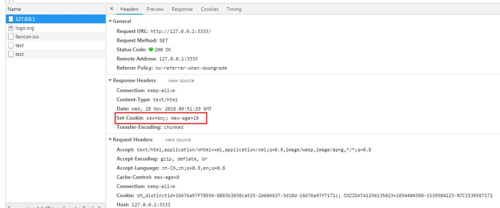
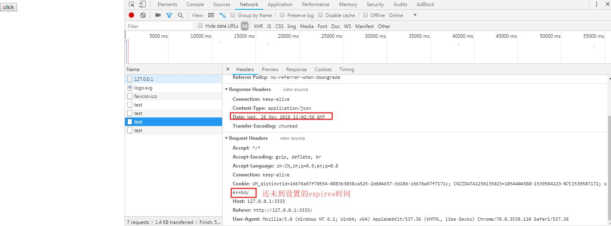

# cookie

服务器端发送到用户浏览器端并保存在客户端本地的一小块数据。

## 生成

服务端返回数据时，通过`Set-Cookie`响应头设置的。

_Node 设置 cookie_

```js
response.setHeader('Set-Cookie', ['type=boy', 'language=javascript']);

// writeHead的优先级会更高，因此会采用writeHead中的Set-Cookie
response.writeHead(200, {
  'Set-Cookie': ['type=girl']
});
```

## 作用

用于会话管理，登录状态判断，购物车等常见的应用场景。下次开始的每一次请求，浏览器都会在请求头`cookie`中携带之前服务端发送过来的 cookie，服务端根据 cookie 判断用户状态。

## 额外的属性

cookie 也支持对其设置一些特有的状态，如有效期，安全性等。

### max-age

过期时间，值是秒。超过该值设置的秒数后，浏览器再次发起请求，就不会携带超时的`cookie`，使用`document.cookie`也无法获取到。旧版本 IE 浏览器（6,7,8）不支持该值，但是可以用`expires`。如果同时设置则`max-age`优先级高。

```js
res.setHeader('Set-Cookie', ['sex=boy; max-age=10']);
```

<!-- 三张图，测试了下`max-age`在浏览器上的表现。 -->




### expires

过期时间，值是日期。日期格式如下：
`<day-name>, <day> <month> <year> <hour>:<minute>:<second> GMT`，这里 GMT 和 UTC 指的是同一个东西，格林威治时间，只是叫法上 UTC 更标准，是一个天文概念。

__day-name__: 其中之一的值"Mon", "Tue", "Wed", "Thu", "Fri", "Sat", or "Sun" (case-sensitive)。

__month__: 其中之一的值"Jan", "Feb", "Mar", "Apr", "May", "Jun", "Jul", "Aug", "Sep", "Oct", "Nov", "Dec" (case sensitive)。

```js
res.setHeader('Set-Cookie', ['sex=boy; expires=Wed, 28 Nov 2018 11:03:10 GMT']);
```

如图：




> 如果不设置`max-age`或`expires`，则浏览器认为这是一个`会话cookie`，浏览器正常关闭就会清空。否则就是一个`持久性cookie`。

### Secure
如果对某个cookie设置了`secure`，则只有在`https`协议下，浏览器才会在跟服务器的通信中携带该cookie。

```js
res.setHeader('Set-Cookie', ['sex=boy; max-age=10; Secure']);
```

### HttpOnly
无法通过`document.cookie`访问，安全性考虑，如 XSS，CSRF。
```js
res.setHeader('Set-Cookie', ['sex=boy; max-age=10; HttpOnly']);
```

### domain
设置了该值，则规定cookie在哪些主机下可以接受`cookie`，如：`Domain=mozilla.org`，则

### path
设置了该值，则指定主机下的哪些路径可以接受cookie，子路径也会被匹配。如`/docs`，则`/docs/web/`也可以。
