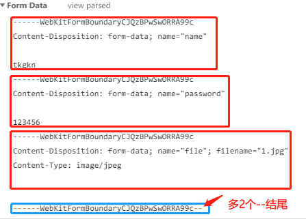

#数据协商

## 客户端请求通过Accept

**Accept**： 客户端想要的数据类型。如`text/html,application/xhtml+xml,application/xml;q=0.9,image/webp,image/apng,*/*;q=0.8`

**Accept-Encoding**：客户端想要的一种数据编码类型。如`Accept-Encoding: gzip, deflate, br`

**Accept-Language**：客户端想要展示的语言（中文还是英文）。如`Accept-Language: zh-CN,zh; q=0.9,en; q=0.8`，这里的`q`代表期望返回语言的权重比。

**User-Agent**：客户端的相关信息，是哪个浏览器，内核，移动还是PC。如`Mozilla/5.0 (Windows NT 10.0; Win64; x64) AppleWebKit/537.36 (KHTML, like Gecko) Chrome/69.0.3497.92 Safari/537.36`

## 服务端响应通过Content

**Content-Type**：实际返回的是什么数据类型（JSON还是HTML之类的）

**Content-Encoding**：服务端用了哪种数据压缩方式

**Content-Language**：返回的语言

## 客户端发送请求时的内容类型
比如form表单的`ectype`属性，允许我们传递3种数据类型。
1. `application/x-www-form-urlencoded`，form表单上传常用的一种类型。发送给服务器的数据格式样式是类似query字符串拼接的，如`a=1&b=2&c=3`

2. `multipart/form-data`，form表单上传文件时常用的一种类型。发送给服务器的数据，每一个键值对都会被分割，包含在一个`boundary`块中，`boundary`的值是请求头中的一个随机生成的值，作用是作为数据分割的标志位。如请求头中`Content-Type: multipart/form-data; boundary=----WebKitFormBoundaryCJQzBPwSwORRA99c`，分割就用`----WebKitFormBoundaryCJQzBPwSwORRA99c`。注意，这里上传的图片就是二进制的格式。分割后的样式大致如下：
