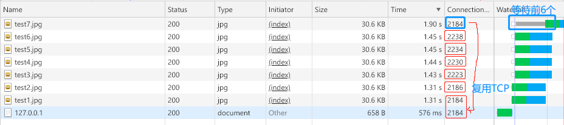

# HTTP

## 1.0
HTTP请求时建立在TCP链接（经历3次握手创建TCP链接通道）之上的。HTTP1.0版本，每次建立起TCP后，发起HTTP请求，就会关闭TCP。多个请求就会造成多次TCP链接，有延迟，且相当耗费服务器资源。

## 1.1
HTTP1.1版本解决了上述问题，创建TCP链接后，不会立刻关闭该通道，服务器通过响应头`Connection: keep-alive`，让客户端和服务器之间的TCP保持长链接状态，多个HTTP请求会复用该TCP链接。如下图对比1.0和1.1。

>注意：浏览器一般有并发限制（一次性并发的TCP请求数），例如chrome是6个。

>注意：HTTP1.1中即便开启了长链接(TCP keep-alive)，但发送的HTTP请求依旧是需要等到前一个HTTP结束后，才能发起下一个，这就是个串行的过程，时间消耗。因此也有一种叫做`管线化`的技术，即建立在HTTP1.1之上，多个HTTP请求在同一个TCP链接中发送，无需等待前一个HTTP的返回才发送，属于并行发送HTTP请求。但是因为某些原因，该技术对客户端来说默认是关闭。