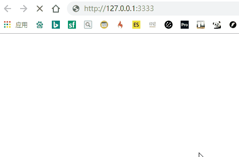

# 重定向

URL 重定向，也称为 URL 转发。是一种资源迁移到新的 URL 时，保持原有旧链接可用的技术。

## 特点和原理

重定向操作由服务器通过发送特殊的响应触发。状态码通常是`3XX`。


## 临时重定向

浏览器端经常遇见的如下

| 状态码    | 解释                                                                                   |
| --------- | -------------------------------------------------------------------------------------- |
| 302 Found | 只是一次性的，重新跳转到某个新地址。因为是临时性，所以每次都会经过服务器来处理下在跳转 |

## 永久重定向

| 状态码                | 解释                                                                                                                                             |
| --------------------- | ------------------------------------------------------------------------------------------------------------------------------------------------ |
| 301 Moved Permanently | 因为是永久性重定向，对于原 URL 的请求，会被浏览器缓存很长时间，所以服务器对相同 URL 在做修改的话，浏览器也不会做相应的重新请求，依旧从缓存获取。 |

## 特殊的重定向

| 状态码           | 解释                                                                                                                          |
| ---------------- | ----------------------------------------------------------------------------------------------------------------------------- |
| 304 Not Modified | 这个压根不应该叫重定向，跟重定向也没很大关系，当使用缓存资源的时候，会浏览器会将资源重新定向到缓存资源，并以 304 状态码返回。 |

## 非服务端的重定向

### HTML的
```html
<meta http-equiv="refresh" content="0;URL=http://127.0.0.1:3333/new" />
```
页面先进入了`http://127.0.0.1:3333`后，由HTML重新定向到`/new`下，会看到第一个被定向页面一闪而过。体验不好。**会让浏览器回退功能失效**




### Javascript
感觉跟`window.locationhref`没啥区别。
```js
window.location = 'xxxx'
```

## 总结
非服务端的重定向都不会涉及到状态码的改变。且都是等页面或脚本加载完后才会触发，因此优先级上，**HTTP协议的重定向机制永远最新触发**，再是`meta`标签内的重定向。

> Nginx重定向
```nginx
server {
  listen 80;
  server_name example.com;
  return 301 $scheme://www.example.com$request_uri
}
```
