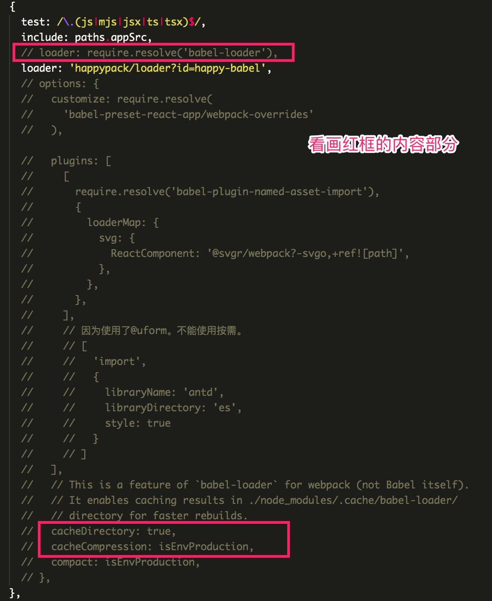
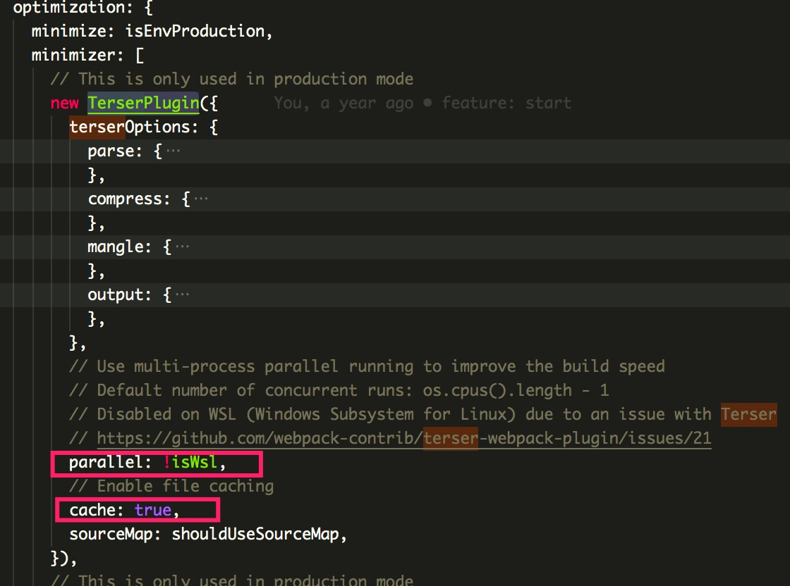
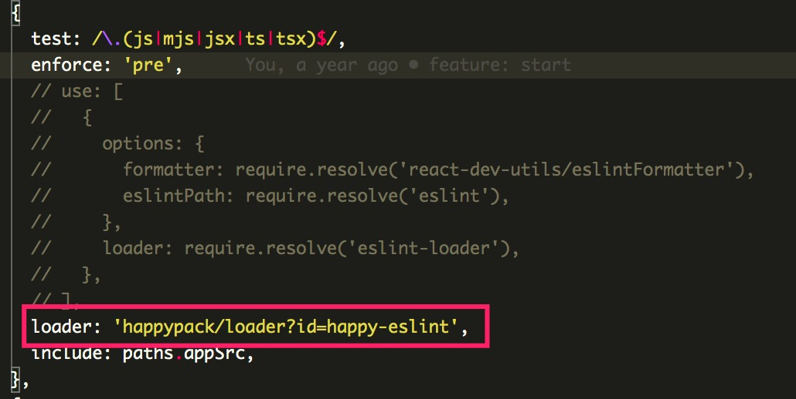
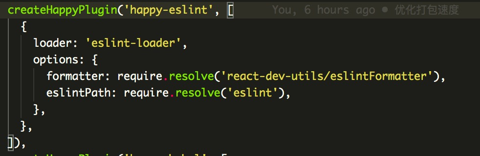

# webpack 优化

手头的业务项目，TS 写的，直接用`create-react-app`脚手架搭建，配置上未做很大改动，只对引用的`antd`做了按需加载。

## 先看下目前的情况

未做任何优化的时候，构建项目的时间较长，首次构建大概在需要 **2** 分钟，第二次需要 **1** 分钟。

之所以第二次时间降低了一半，是因为`CRA`脚手架本身的`webpack.config`配置里，编译`js`的`babel-loader`和压缩`js`的`terser-webpack-plugin`都开启了缓存和并发线程。可以`eject`出来`webpack`配置看下：

该 Loader 开启了缓存目录，避免大量代码重复的 AST 转换。


该插件压缩代码用，开启了多进程并行和缓存，同上。


## 优化编译速度

因为项目本身的特点，不需要网络请求打包资源，而是本地资源加载，所有主要优化的点在于编译速度。

### 省去 map 文件

项目跑在 UE4 软件中，没有类似`chrome`的开发者工具，无法调试，调试靠的是`console`日志。因此去掉 map 文件输出，map 文件本身占了十几 mb。


`CRA`脚手架的 map 文件控制，是根据环境变量来的，所以可以在`package.json`的命令里增加`cross-env GENERATE_SOURCEMAP=false`

在没有`.catch`文件的情况下，打包时长 **Done in 93.96s**

> PS 虽然不输出，但是对编译速度没有影响

### 使用 happypack

因为 webpack 是基于 node 的，操作文件，Node 本身又是 js，单线程。所以打包速度提升，我们可以使用多线程的技术，`node`本身可以开额外的子进程。

1. 安装`happypack`包
2. 这里将对应`rules`里`test`匹配的文件的`loader`修改掉，我们将`eslint-loader`, `babel-loader`替换为`happypack/loader?id=happy-eslint`和`happypack/loader?id=happy-babel`，且删除原本`loader`的配置（后面用）
3. 通过`new Happypack({id, loaders, threadPool})`,id 就是上面步骤中的 id 值，loaders 就是原本的`loader`，比如`eslint-loader`等，然后原本的配置在配置`loaders`的时候传入。如图：





经测试后，在没有`.catch`文件的情况下，打包速度降到 **Done in 76.17s.**

### 使用 DllPlugin 动态链接库技术

webpack 自带的插件`webpack.DllPlugin`可以将我们指定的包打包出来，然后再用`webpack.DllReferencePlugin`去引用我们打包出来的链接库文件就可以。

核心思想就是，一些库如`react`并不会随着开发阶段而频繁改动，甚至不改动的包，我们将其先从依赖中抽离打包成动态的 js 库，后续打包就不在需要打这部分的相关包，而只需要将打包好 dll.js 引入即可。可以高效的提高编译速度。

使用方法：

1. 先创建一个`webpack.dll.config.js`，配置下需要单独打包出来的包。

```js
const webpack = require('webpack');
const path = require('path');
const { CleanWebpackPlugin } = require('clean-webpack-plugin');
// 这里放到public文件夹里，打包的过程会将public文件复制到dist目录，CRA帮我们做好了。
const dllPath = path.resolve(__dirname, '../public/dll');

module.exports = {
  entry: {
    // 这是所有我需要的优先打包出来的包
    vendors: [
      'react-animate-height',
      'react-color',
      'react',
      'react-dom',
      'react-transition-group',
      'dva',
      'axios',
      'classnames',
      '@formily/antd',
      '@formily/antd-components',
      '@formily/react',
      '@formily/react-schema-renderer',
    ],
  },
  // 生成的动态链接库文件信息。
  output: {
    filename: '[name]-[hash].dll.js',
    path: dllPath,
    // 生成的动态链接库js文件中，定义了一个全局的函数名，这个函数名是暴露出去使用的
    library: '_dll_[name]',
  },
  plugins: [
    // 每次dll脚本跑之前，先清空下dll文件。
    new CleanWebpackPlugin({
      cleanOnceBeforeBuildPatterns: [dllPath],
    }),
    // 生成动态链接库的描述文件。
    new webpack.DllPlugin({
      // 生成的描述文件manifest.json中有个字段，name属性的值，需要跟上面暴露的全局函数名称一致。
      name: '_dll_[name]',
      // manifest.json 描述动态链接库包含了哪些内容
      path: path.join(dllPath, '[name].dll.manifest.json'),
    }),
  ],
};
```

2. 在`package.json`中配置一条`scripts`命令，打包`dll`。这里需要注意下`CRA`本身没有安装`webpack-cli`命令行工具，我们这里用到了`webpack`命令，所以大家记得安装`webpack-cli`，打包模式当然是生产环境。
   如：`"dll": "webpack --mode production --config config/webpack.dll.config.js",`

跑起该命令，你会发现在`public`目录里，增加了一个`dll`目录，里面有 2 个文件，一个`js`，一个`manifest.json`文件。因为我们上面的`webpack.dll.config.js`配置的`dllPath`路径是`public`，不能配置到`build`里，不然再走`build`命令时，`CRA`先给清空了`build`目录。

3. 在`webpack.config.js`配置中，`plugins`中增加对上述文件的引用。

```js
new webpack.DllReferencePlugin({
  manifest: path.resolve(
    __dirname,
    '../public/dll',
    'vendors.dll.manifest.json'
  ),
}),
```

4. 这里手动对`public/index.html`中进行`dll.js`文件的引用。当然你的`dll`如果经常变动，建议使用插件`add-asset-html-webpack-plugin`来动态引入，功能跟`html-webpack-plugin`类似，可以自动引入脚本样式文件，我这里没有用，因为文件不会频繁变动，所以直接手动在`html`中引入了。

```html
<body>
  <!-- 其他内容 -->
  <script src="/dll/vendors-56b8033e12fc93dfe0e6.dll.js"></script>
</body>
```

经测试后，在没有`.catch`文件的情况下，打包速度降到 **Done in 50.88s.**

## 配合缓存

打包在`cache`的加持下，速度得到很大优化。经测试，再次打包（保存`/node_modules/.cache`）的情况下，打包速度只要 **Done in 22.95s.**。

从最开始的将近**120s**缩短**20s**，提升了 6 倍。

## 额外的了解 externals

期间还了解到了 webpack 的`externals`配置，跟`dllplugin`有异曲同工之效。

`dllplugin`是提前将部分包打包好，不在参与后续每次打包。

而`externals`是完全不参与提前或之后的每次打包，而是通过外部资源引用的方式，如`script src`的形式通过`http`加载或本地资源加载，由用户保证提供所需的包功能。如果结合好`cdn`或`http2多路复用`的特性，可以实现加载速度快，且以后这些常用资源全部走缓存，不同的项目可以得益同样的资源，也是一种优化打包速度的方式。

# 总结

以上是对业务项目编译速度的一次优化探索。
